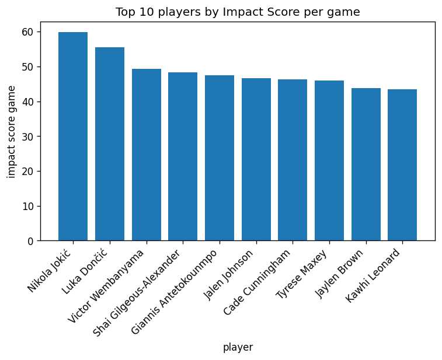
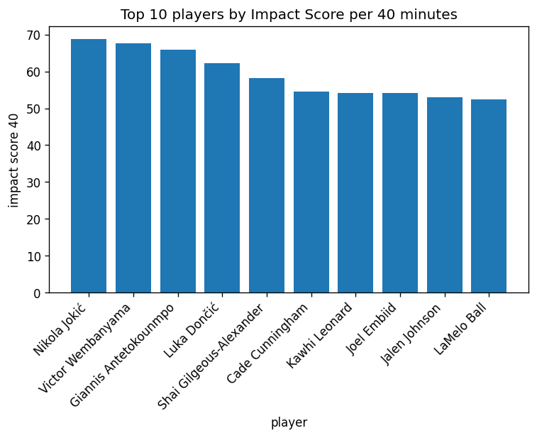
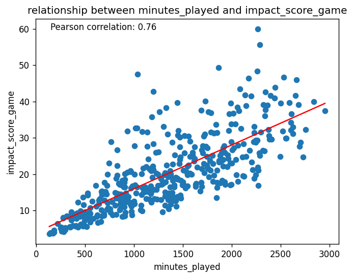
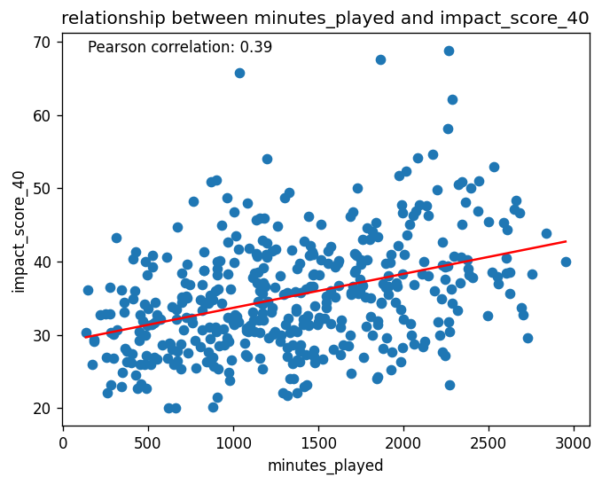
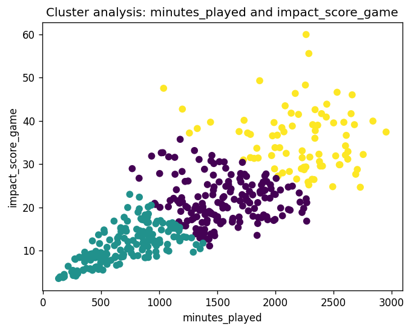
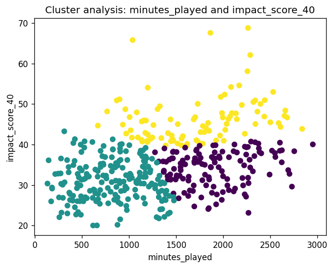
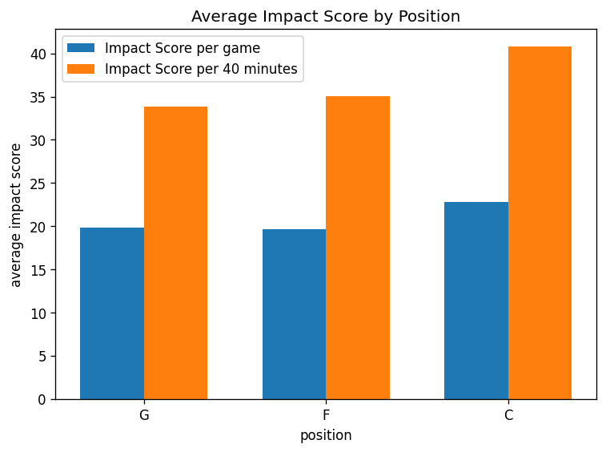

# Player Impact in the 2025-26 NBA Regular Season

**Analytical report — Impact Score, per game and per 40 minutes**

| | |
|---|---|
| **Dataset** | `nba_players_25_26_regular_season_wide_data.csv` — 582 players, 28 variables |
| **Population analysed** | 419 players (after the eligibility filter) |
| **Indicator** | Impact Score, in two versions: per game and per 40 minutes |
| **Script** | `nba_analysis.py` |
| **Charts** | `charts/` (7 figures, reproduced below) |

---

## 1. Executive summary

The analysis measures how much each player contributes to a game through a single weighted indicator, the **Impact Score**, built from points, rebounds, assists, steals, blocks and turnovers. The indicator is computed in two versions — **per game**, which captures total production, and **per 40 minutes**, which captures efficiency per unit of time — and the whole analysis is run twice, once per version, so that the two readings can be compared.

Main findings:

1. **Nikola Jokić leads both rankings** (59.93 per game, 68.81 per 40 minutes). He is the only player in the top 10 who is simultaneously first in rebounds and assists among that group, while averaging a near-triple-double: 27.68 points, 12.86 rebounds, 10.72 assists.
2. **The two rankings agree on 8 of 10 names.** The indicator is therefore robust: normalising by playing time reshuffles the order but does not change who the best players are.
3. **Minutes played explain most of the per-game score, and little of the per-40 score.** The Pearson correlation drops from **0.76** to **0.39** — from about 58% of the variance explained to about 15%.
4. **Impact rises with age, but this is a selection effect.** The 35+ band has the highest average in both versions (26.03 and 39.09), yet it contains only 20 of the 419 eligible players.
5. **Centres have the highest impact on both metrics** (22.81 per game, 40.78 per 40 minutes). Their margin over the guards widens from about 15% to about 21% once playing time is normalised — a direct consequence of the weight the formula assigns to rebounds and blocks.

---

## 2. Objective and scope

The exercise asks a simple question — *who has the greatest impact on the game, and what characterises those players* — and answers it with a synthetic indicator rather than with a single box-score statistic.

The report covers: the ranking of players, the average profile of the best ones, the distribution of impact by age band and by position, and the relationship between impact and playing time. It does **not** attempt to predict future performance, evaluate teams, or reproduce any official NBA metric.

---

## 3. Data and method

### 3.1 Dataset

Individual season totals for the 2025-26 NBA Regular Season: 582 players and 28 variables. The analysis uses the identifying columns (`player_name`, `age_completed_years`, `team`, `position`), the minutes played, the counting statistics that enter the formula, and `wins` / `losses`, from which games played is derived.

Season totals are converted to **per-game averages** before anything else, so that players with different numbers of games can be compared.

### 3.2 The Impact Score

```
impact_score_game = PTS + 1.2 · REB + 1.5 · AST + 2 · STL + 2 · BLK − TOV

impact_score_40   = (PTS + 1.2 · REB + 1.5 · AST + 2 · STL + 2 · BLK − TOV) / MIN · 40
```

The weights reward the actions with the highest added value — assists, steals and blocks — and subtract turnovers. Every input is a per-game average; `MIN` is average minutes per game.

The two versions answer different questions. The per-game score measures **how much a player produces in total**, and is therefore tied to the minutes the coach gives them. The per-40 score measures **how much a player produces per unit of time**, making players with very different roles comparable.

> **Note on scale.** The two versions are not comparable with each other in absolute terms. No one averages 40 minutes, so the normalisation rescales every score upwards — for a player at 33 minutes per game, the per-40 score is 40/33 ≈ 1.21 times the per-game score. Each number must be read within its own column.

### 3.3 Eligibility filter

Normalising by minutes rewards players with very small samples: a player with 5 minutes and one good possession would top the ranking. The analysis therefore keeps only players with at least **one third of the games of the most used player**.

On this dataset the threshold works out at **27.3 games** (1/3 of 82), which keeps **419 of 582 players**. The threshold is relative rather than a fixed number of games, so it also behaves correctly on a season still in progress.

### 3.4 Handling of edge cases

- Missing `wins` / `losses` are treated as 0 games played.
- Players with 0 games played, or 0 minutes per game, become `NaN` rather than a division by zero, and drop out of the analysis as missing data.
- Charts that cannot handle missing values (regression line, K-Means) drop incomplete rows before computing.

---

## 4. Results

### 4.1 Top 10 by Impact Score per game

| # | Player | Age | Pos | Team | Impact Score |
|---|---|---|---|---|---|
| 1 | Nikola Jokić | 31 | C | DEN | **59.93** |
| 2 | Luka Dončić | 27 | F | LAL | 55.54 |
| 3 | Victor Wembanyama | 22 | F | SAS | 49.26 |
| 4 | Shai Gilgeous-Alexander | 27 | G | OKC | 48.26 |
| 5 | Giannis Antetokounmpo | 31 | F | MIL | 47.51 |
| 6 | Jalen Johnson | 24 | F | ATL | 46.59 |
| 7 | Cade Cunningham | 24 | G | DET | 46.32 |
| 8 | Tyrese Maxey | 25 | G | PHI | 46.00 |
| 9 | Jaylen Brown | 29 | G | BOS | 43.84 |
| 10 | Kawhi Leonard | 35 | F | LAC | 43.46 |

**Top 10 average Impact Score: 48.67 — average age: 27.5 years.**



*Figure 1 — Top 10 by Impact Score per game.*

The distribution is markedly top-heavy: Jokić stands 4.4 points clear of Dončić, and Dončić in turn stands 6.3 clear of third place, after which the curve flattens — positions 3 to 10 are separated by less than 6 points in total. In practice the ranking identifies two players at a distinct tier, then a dense group of elite players who are hard to separate on this metric.

### 4.2 Top 10 by Impact Score per 40 minutes

| # | Player | Age | Pos | Team | Impact Score |
|---|---|---|---|---|---|
| 1 | Nikola Jokić | 31 | C | DEN | **68.81** |
| 2 | Victor Wembanyama | 22 | F | SAS | 67.60 |
| 3 | Giannis Antetokounmpo | 31 | F | MIL | 65.82 |
| 4 | Luka Dončić | 27 | F | LAL | 62.12 |
| 5 | Shai Gilgeous-Alexander | 27 | G | OKC | 58.11 |
| 6 | Cade Cunningham | 24 | G | DET | 54.60 |
| 7 | Kawhi Leonard | 35 | F | LAC | 54.21 |
| 8 | Joel Embiid | 32 | C | PHI | 54.05 |
| 9 | Jalen Johnson | 24 | F | ATL | 53.00 |
| 10 | LaMelo Ball | 24 | G | CHA | 52.35 |

**Top 10 average Impact Score: 59.07 — average age: 27.7 years.**



*Figure 2 — Top 10 by Impact Score per 40 minutes.*

Once playing time is removed, the top of the ranking compresses: the first three are separated by 3 points, against the 10.7 that separate the top three of the per-game ranking. Jokić keeps first place by a much narrower margin.

### 4.3 What changes between the two rankings

**Eight of the ten names are the same.** The differences are informative:

| Direction | Player | Avg minutes | Reading |
|---|---|---|---|
| Drops out | Tyrese Maxey | 38.02 | The heaviest workload in the per-game top 10; his production is partly a function of time on court |
| Drops out | Jaylen Brown | 34.41 | Same pattern, less pronounced |
| Enters | Joel Embiid | 31.60 | Produces at a top-5 rate in fewer minutes |
| Enters | LaMelo Ball | 28.02 | The lowest workload of the per-40 top 10 |

The players who **gain** most from normalisation are those with a high rate in limited minutes: Wembanyama moves from 3rd to 2nd (29.15 minutes), Antetokounmpo from 5th to 3rd (28.87 minutes). The player who **loses** most is Dončić, from 2nd to 4th, and he also has the highest workload of the leading group (35.76 minutes).

### 4.4 Statistical profile of the leading players

Per-game averages of the ten highest per-game scores:

| Player | Pos | PTS | REB | AST | STL | BLK | TOV | MIN |
|---|---|---|---|---|---|---|---|---|
| Nikola Jokić | C | 27.68 | **12.86** | **10.72** | 1.42 | 0.82 | 3.74 | 34.84 |
| Luka Dončić | F | **33.48** | 7.73 | 8.28 | 1.64 | 0.53 | **3.98** | 35.76 |
| Victor Wembanyama | F | 25.00 | 11.50 | 3.11 | 1.03 | **3.08** | 2.42 | 29.15 |
| Shai Gilgeous-Alexander | G | 31.13 | 4.29 | 6.59 | 1.40 | 0.76 | 2.22 | 33.22 |
| Giannis Antetokounmpo | F | 27.58 | 9.78 | 5.44 | 0.94 | 0.67 | 3.19 | 28.87 |
| Jalen Johnson | F | 22.51 | 10.28 | 7.86 | 1.24 | 0.43 | 3.39 | 35.16 |
| Cade Cunningham | G | 23.92 | 5.55 | 9.91 | 1.44 | 0.84 | 3.69 | 33.93 |
| Tyrese Maxey | G | 28.29 | 4.14 | 6.59 | 1.86 | 0.79 | 2.44 | **38.02** |
| Jaylen Brown | G | 28.70 | 6.93 | 5.13 | 1.01 | 0.38 | 3.65 | 34.41 |
| Kawhi Leonard | F | 27.89 | 6.35 | 3.60 | **1.88** | 0.42 | 2.05 | 32.07 |

Three routes to a high score emerge:

- **Volume across all categories** — Jokić leads the group in both rebounds and assists while scoring 27.68 points. Since rebounds and assists carry weights of 1.2 and 1.5, being first in both is worth more than being first in scoring.
- **Scoring volume** — Dončić has the highest point total, 2.35 above the next player, but also the highest turnover count, which the formula subtracts. He is second, not first.
- **Weighted specialisation** — Wembanyama scores the least of the top four, but his 3.08 blocks, weighted 2, are worth 6.16 points on their own, more than double any other player in the group.

### 4.5 Impact by age band

| Band | Players | Avg per game | Max per game | Avg per 40 min | Max per 40 min |
|---|---|---|---|---|---|
| 19–22 | 75 | 17.97 | 49.26 | 34.32 | 67.60 |
| 23–26 | 162 | 19.76 | 46.59 | 35.03 | 54.60 |
| 27–30 | 115 | 21.00 | 55.54 | 35.33 | 62.12 |
| 31–34 | 47 | 21.04 | **59.93** | 36.10 | **68.81** |
| 35+ | 20 | **26.03** | 43.46 | **39.09** | 54.21 |

The average impact rises monotonically with age in both versions, and the 35+ band leads by a clear margin. **This is a selection effect, not evidence that players improve with age.** At 35 a player is only still on a roster — and only still passes the games filter — if they are performing at a high level, whereas the younger bands contain the full spread of the league, bench players included. The band sizes make this visible: 20 players at 35+ against 162 in the 23–26 band.

The maxima tell a different and more reliable story: the highest individual scores in both versions belong to the 31–34 band (Jokić), with the 27–30 band next. Peak individual performance sits in the late twenties and early thirties.

### 4.6 Playing time and impact

Pearson correlation between minutes played over the season and the Impact Score:

| Relationship | Pearson | Variance explained (r²) |
|---|---|---|
| `minutes_played` ↔ `impact_score_game` | **0.76** | ≈ 58% |
| `minutes_played` ↔ `impact_score_40` | **0.39** | ≈ 15% |



*Figure 3 — Minutes played against Impact Score per game, with the linear regression line.*

**How to read it.** Each point is one of the 419 eligible players. The cloud is clearly oriented along the regression line, and the lower-left corner is dense: players with few minutes systematically produce little in absolute terms. This is largely mechanical — the more you play, the more you accumulate — and it is exactly the bias the second version of the indicator is designed to remove.



*Figure 4 — Minutes played against Impact Score per 40 minutes, with the linear regression line.*

**How to read it.** The same 419 players, with impact normalised. The cloud is now much flatter and the vertical spread is roughly constant across the whole range of minutes: a player at 500 minutes can reach the same rate as a player at 2500. The residual positive slope is the interesting part — with the mechanical component removed, what remains suggests coaches do give more minutes to the more efficient players, though far from perfectly.

### 4.7 Cluster analysis

K-Means with 3 clusters on standardised minutes played and Impact Score. Standardisation is necessary because the two variables live on very different scales; without it the euclidean distance would be dominated by minutes.



*Figure 5 — Three clusters on minutes played and Impact Score per game.*

**How to read it.** The three groups line up as parallel bands along the same diagonal: low usage and low production, a middle group, and a high-usage high-production group. The algorithm has not found qualitatively different profiles — it has cut the same linear relationship into three slices. This is itself confirmation of how strong that relationship is.



*Figure 6 — Three clusters on minutes played and Impact Score per 40 minutes.*

**How to read it.** The structure changes completely. The clusters no longer stack along a diagonal: one group is defined by low playing time, one by high playing time with a middling rate, and the third — the upper band — is defined by **efficiency alone** and spans essentially the whole horizontal axis, from around 1,000 minutes to the most used players in the league. This third group is the one the per-40 indicator was built to isolate: players who produce at a high rate whatever their role in the rotation.

### 4.8 Impact by position

The dataset labels players with seven positions, including hybrids such as `G-F` or `C-F`. Three of those groups hold fewer than 25 of the 419 eligible players and `F-G` holds only 9 — too few for an average to mean anything. Positions are therefore **collapsed onto the primary one**, the first label listed: `G-F` → `G`, `F-G` and `F-C` → `F`, `C-F` → `C`. The collapse is applied during data preparation, so every table in this report uses the three-way label.

| Position | Players | Avg minutes | Impact per game | Impact per 40 min |
|---|---|---|---|---|
| `G` | 204 | 22.57 | 19.88 | 33.84 |
| `F` | 155 | 21.54 | 19.67 | 35.09 |
| `C` | 60 | 21.62 | **22.81** | **40.78** |



*Figure 7 — Average Impact Score by position, per game (blue) and per 40 minutes (orange). Positions are ordered along the guard → centre continuum.*

**How to read it.** Both series peak at the centres, and the orange series peaks harder. The effect is specific to the comparison with the guards: the centres' margin over `G` goes from 14.7% per game to 20.5% per 40 minutes, while their margin over `F` barely moves (16.0% to 16.2%). Centres average slightly fewer minutes than guards (21.62 against 22.57) and about the same as forwards, so removing playing time from the measure only works in their favour against the group that plays more.

This is the expected result given the formula: rebounds are weighted 1.2 and blocks 2, and both are categories where centres accumulate most. Wembanyama's 3.08 blocks per game, worth 6.16 points of Impact Score on their own, are the individual illustration of a positional effect.

Guards and forwards are, for practical purposes, indistinguishable: 0.21 apart per game, and they swap order once normalised (33.84 against 35.09). The reason is the same one that runs through the whole analysis — guards average about one minute more per game, which is enough to put them marginally ahead on a volume measure and marginally behind on a rate measure. **The only robust positional conclusion is the advantage of the interior.**

---

## 5. Conclusions

| Question | Per game | Per 40 minutes |
|---|---|---|
| Highest impact player | Nikola Jokić (59.93) | Nikola Jokić (68.81) |
| Top 10 average Impact Score | 48.67 | 59.07 |
| Top 10 average age | 27.5 | 27.7 |
| Age band with the highest impact | 35+ (26.03) | 35+ (39.09) |
| Correlation with minutes played | 0.76 | 0.39 |
| Position with the highest impact | C (22.81) | C (40.78) |

1. **Jokić is the most impactful player of the season on this metric, on both readings.** Leading a volume-based indicator and an efficiency-based one at the same time is the strongest result the analysis produces: his advantage does not depend on how long he is on the court.
2. **The indicator is stable where it matters.** Eight of the ten names are common to both rankings; normalisation reorders the top but does not replace it.
3. **Playing time is the main confounder of any per-game measure**, and quantifiably so: it accounts for roughly 58% of the variance of the per-game score against 15% of the per-40 score. Any ranking based on per-game totals is in large part a ranking of who the coach trusts.
4. **The age result is a trap worth naming.** The 35+ band leads both averages, but on 20 players who are on rosters precisely because they are still good. Peak individual performance, read from the maxima, sits in the 27–34 range.
5. **Centres have the highest impact, and it is the one positional result that holds on both metrics.** Guards and forwards are 0.21 apart per game and change order when normalised, so no meaningful difference separates them. The centres' advantage, by contrast, is present in both versions and widens under normalisation — although it should be read as a property of the formula's weights as much as of the players: an indicator that rewards rebounds and blocks will favour the positions that produce them.

---

## 6. Limitations

- **The weights are a modelling choice, not a measurement.** The formula and its coefficients are defined by this exercise; they are not an official NBA metric. Different weights would produce a different ranking.
- **The indicator ignores defence beyond steals and blocks**, and ignores shooting efficiency entirely: a player who scores 30 points on 30 shots and one who scores 30 on 18 receive the same credit. The attempted-shot columns in the dataset are not used.
- **Team context is not modelled.** Playing next to a dominant creator, or on a fast-paced team, inflates the counting statistics the indicator is built on.
- **The eligibility filter is a trade-off.** It removes small-sample noise, but with it 163 players, and any genuinely efficient low-usage player among them.
- **The season may be in progress.** The figures describe the dataset as it stands, not a completed season.

---

## 7. Reproducibility

```bash
pip install pandas numpy matplotlib scikit-learn
python nba_analysis.py
```

The script prints every table in this report to the console, in the order of sections 4.1 to 5, and then opens the seven figures. The charts in `charts/` are those same figures saved to file. Method details, function-by-function documentation and implementation notes are in [README.md](README.md).
